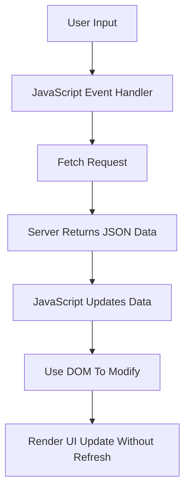

## Single Page App Diagram

```mermaid
flowchart TD
    A[User Input] --> B[JavaScript Event Handler]
    B --> C[Fetch Request]
    C --> D[Server Returns JSON Data]
    D --> E[JavaScript Updates Data]
    E --> F[Use DOM To Modify ]
    F --> G[Render UI Update Without Refresh]
```